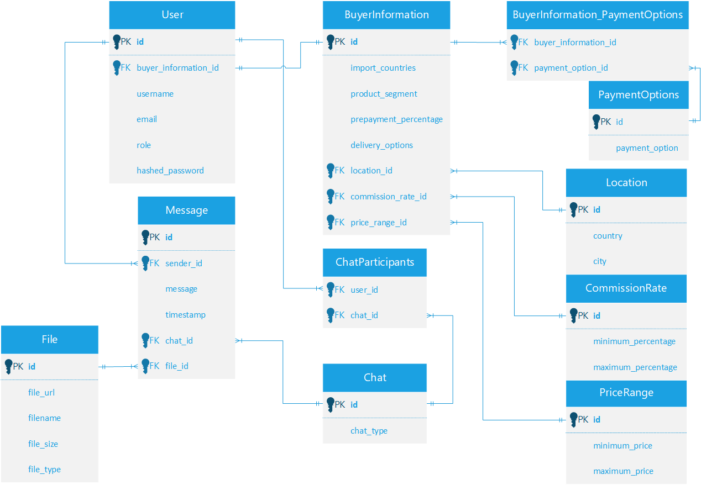

# CleanBuy
___

## Table of Contents


- [Overview](#overview)
- [Requirements](#requirements)
- [Deploying on Local](#deploying-on-local)
- [Alembic Migrations](#alembic-migrations)
- [Switch on HTTPS](#switch-on-https)
- [Testing](#testing)
- [Code Coverage](#code-coverage)
- [Deploying via Docker](#deploying-via-docker)
- [Database Schema](#database-schema)
- [Author](#author)

## Overview

***Cleanbuy*** is an e-commerce platform featuring real-time chat,
enabling buyers and sellers to negotiate deals using a user-friendly
web interface. Also, the system supports registration and user authentication.

✅ https://localhost:443/pages/home - start page.

✅ https://localhost:443/pages/chat - page after login for chatting with users.

✅ https://localhost:443/pages/account - page for viewing account information.

## Requirements⚠️️

- Python 3.8+
- FastAPI
- SQLAlchemy
- PostgreSQL
- Kafka
- AWS S3 (using ***IDriver***)
- Docker (for deployment through containers)
- WebSocket
- Jinja2
- ... (read *requirements.txt*)

## Database Schema
___



## Deploying on Local
___

**Step 1:**

Create a virtual environment.

###### *Linux / macOS:*

```bash
python3 -m venv venv
source venv/bin/activate
```

###### *Windows:*

```bash
python -m venv venv
source venv/Scripts/activate
```

**Step 2:**

Create a **.env** files in the project directory and fill it with your data:

```env.auth
# env.auth

SECRET_KEY                  - for auth (for JWT tokens)
ALGORITHM                   - hash algorithm for auth (e.g. HS256)
ACCESS_TOKEN_EXPIRE_MINUTES - (e.g. 30)
```
To get a string for **SECRET_KEY** you can run:
```bash
openssl rand -hex 32
```
```env.db
# env.db

DB_HOST                     - ip address of your database (e.g. localhost)
DB_PORT                     - port of database (e.g. 5432)
DB_USER                     - user name (owner) of database (e.g. postgres)
DB_PASS                     - password for access to database (e.g. 1234)
DB_NAME                     - database name (e.g. cleanbuy)
```
```env.kafka
# env.kafka

KAFKA_BOOTSTRAP_SERVERS     - (e.g. kafka:9093)
KAFKA_TOPIC=chat-messages   - topic name for kafka (e.g. chat-messages)
KAFKA_GROUP_ID              - group id for kafka (e.g. my-chat-group)
```
```env.s3
# env.s3

ACCESS_KEY                  - access key for s3 storage (usually autogenerated on site)
SECRET_KEY                  - secret key for s3 storage (usually autogenerated on site)
ENDPOINT_URL                - url of your s3 storage (e.g. https://k7m8.la.idrivee2-37.com)
BUCKET_NAME                 - bucket name of your s3 storage
```

**Step 3:**

```bash
pip install -r requirements.txt
```

**Step 4:**


If you use ___HTTP___ run:
```bash
uvicorn src.main:app --reload
```

To implement HTTPS into your project read chapter [Switch on HTTPS](#switch-on-https). \
If you use ___HTTPS___ run:
```bash
uvicorn src.main:app --host 0.0.0.0 --port 443 --ssl-keyfile certs/key.pem --ssl-certfile certs/cert.pem
```

## Alembic Migrations
___

This project uses Alembic to migrate databases.\
The basic commands are as follows:

```bash
alembic init -t async migrations
alembic revision --autogenerate -m "your-comment-for-revision"
alembic upgrade head
```

## Switch on HTTPS
___

The following shows the implementation of HTTPS in a project on the __Windows__ platform.

**Step 1. Installing *Chocolatey***

- Open cmd.exe as Administrator
- Run the following command:

```bash
@"%SystemRoot%\System32\WindowsPowerShell\v1.0\powershell.exe" -NoProfile -InputFormat None -ExecutionPolicy Bypass -Command "[System.Net.ServicePointManager]::SecurityProtocol = 3072; iex ((New-Object System.Net.WebClient).DownloadString('https://community.chocolatey.org/install.ps1'))" && SET "PATH=%PATH%;%ALLUSERSPROFILE%\chocolatey\bin"
```

- Check if *Chocolatey* is installed by the following command:

```bash
choco
```

You must see:

```plaintext
Chocolatey v2.3.0
Please run 'choco -?' or 'choco <command> -?' for help menu.
```

**Step 2. Generating self-signed certificates**

- Run the following command:

```bash
choco install mkcert
```

- Run the following command:

```bash
mkcert -install
```

You must see:

```plaintext
Created a new local CA 💥
The local CA is now installed in the system trust store! ⚡️
The local CA is now installed in Java's trust store! ☕️
```

- And run the last command:

```bash
mkcert localhost 127.0.0.1
```

You must see:

```plaintext
Created a new certificate valid for the following names 📜
 - "localhost"
 - "127.0.0.1"

The certificate is at "./localhost+1.pem" and the key at "./localhost+1-key.pem" ✅
It will expire on 14 November 2026 🗓
```

At the result we have two files: ___localhost+1.pem___ and ___localhost+1-key.pem___. Rename these files to ___cert.pem___ and ___key.pem___ accordingly and move them to the ***certs*** folder. \
Now you can use ***HTTPS*** in your project by running the following command:

```bash
uvicorn src.main:app --loop asyncio --host 0.0.0.0 --port 443 --ssl-keyfile=certs/key.pem --ssl-certfile=certs/cert.pem
```

## Testing
___

**PyTest** is used for testing. The following values need to be defined:

```env.test
# env.test

DB_HOST_TEST         - DB_HOST analog
DB_PORT_TEST         - DB_PORT analog 
DB_NAME_TEST         - DB_NAME analog
DB_USER_TEST         - DB_USER analog
DB_PASS_TEST         - DB_PASS analog
```

Run the tests:

```bash
pytest -v -s tests/unit/
```
- **-v** (or **--verbose**): This flag enables verbose output.
Instead of the standard dots (.) for passing tests and exclamation
marks (!) for failing tests, *-v* causes pytest to print a full list 
of tests, listing each test method and its result (e.g. **PASSED** or **FAILED**).
This helps you better understand which tests passed or failed.
- **-s**: This flag disables capturing stdout and stderr output while
running tests. Normally, pytest captures output and displays it only
if a test fails. With the *-s* flag, all output (e.g. print results,
log entries, etc.) is displayed in the console in real time. This is
useful for debugging, as you can immediately see any output from your
code or tests.
- **tests/unit/**: This is the path to the directory where the tests
you want to run are located. In this case, pytest will look for test
files in the *tests/unit/* directory. Test files usually have a
*test_* prefix or a *_test.py* suffix.

## Code Coverage

To view code coverage by tests, you can use the following commands:

- generate a report in web format:
    ```bash
    pytest --cov-report html:cov_html --cov=src tests/unit/
    ```
- generate a report in the console:
    ```bash
    pytest --cov-report term --cov=src tests/unit/                    # generate a report in the console
    ```

## Deploying via Docker
___

Below are the basic commands to manage docker.

###### Image creating

```bash
docker build . --tag cleanbuy
docker run -p 443:443 cleanbuy
```

###### Docker-compose

```bash
docker-compose up --build
docker-compsose down
```

## Author
___

Designed by _Alexey Klimovich_, 2024
